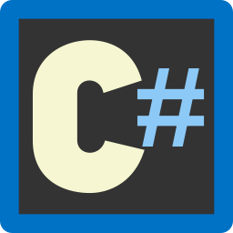
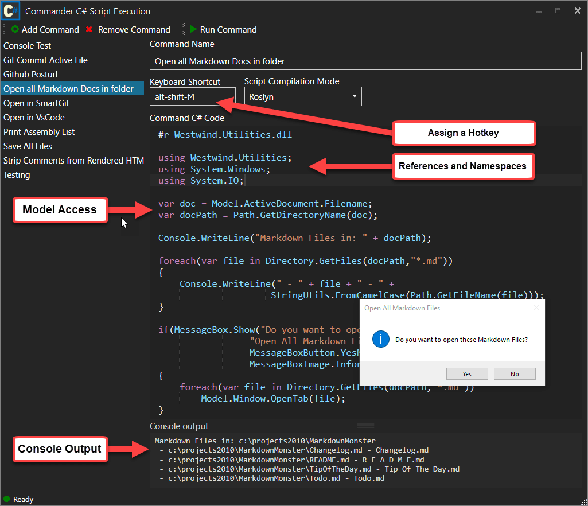
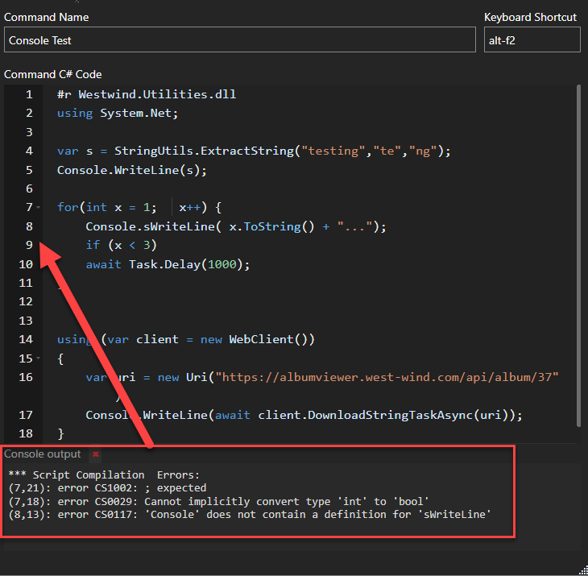

# Markdown Monster Commander Addin

#### A C# scripting addin for Markdown Monster



This addin allows you to script [Markdown Monster](https://markdownmonster.west-wind.com) via C# script code that is compiled and executed dynamically. It's an easy way to add quick automation features to Markdown Monster without the complexities creating a [full Markdown Monster .NET Addin](http://markdownmonster.west-wind.com/docs/_4ne0s0qoi.htm).



Some things you can do:

* Access the current document
* Modify the active or any other open document
* Launch a new process 
* Open documents or folders in an external Program
* Load data from a database and embed it in a document
* Open current document in another editor at line number
* Open all related documents
* Open a Git Client in the right folder context
* Launch an image optimizer to optimize all images
* Create pre-filled documents into the editor  
*(you can also do this with the [Snippets addin](https://markdownmonster.west-wind.com/docs/_5gs0uc49h.htm))*
* etc.

Using the Command Addin you can access the [Markdown Monster Application Model](https://markdownmonster.west-wind.com/docs/_67613zlo8.htm) (via `Model.AppModel`) to access many of the core Markdown Document and UI features that let you automate and act upon open or selected documents in the editor.

Snippets can be manually executed and debugged, or you can can  tie a keyboard shortcut to a Commander script and invoke it directly without the Snippet Form being active.

### Features
Commander has the following  useful features:

* C# Scripting - full C# language access
* Access to Markdown Monster's Model
    * Access to Document
    * Access to Editor
    * Access to Main Window and the entire WPF UI
* Console Output
* Language Features
    * Latest C# compiler features
    * Async support <small>(required for most editor access now)</small>
    * Compilation and Runtime Error reporting
    * Source Code display

### C# Script Execution
Scripts are executed as C# code that is compiled dynamically as 'in memory' assemblies. The addin caches generated assemblies so that multiple executions don't keep generating new assemblies on repeated use.

You can execute any .NET code as long as you can reference the required assemblies you need for your code.

#### Script Execution
Scripts are turned into a C# class that is then compiled into an assembly and executed. Assemblies are created dynamically and cached once generated based on the code snippet's content (plus the compiler mode). If you execute the same script repeatedly, one assembly is generated and used repeatedly. Each new or modified snippet generates a new assembly when it is executed for the first time - subsequent invocations are cached and thus faster.

Scripts include default assemblies and namespaces that are used in Markdown Monster , so most features that are used in Markdown Monster are already in scope and accessible without adding explicit `#r` assembly references or `using` statements. Add references and namespaces only if you get compilation errors to that effect.

Scripts execute in the context of a class method in the following format:

```cs
public async Task<string> ExecuteScript(CommanderAddinModel Model)
{
	// YOUR CODE GOES BELOW

	// #r Westwind.Utilities.dll
	// using System.Net;
	
	var s = StringUtils.ExtractString("testing","te","ng");
	Console.WriteLine(s);
	
	for(int x = 1;   x++) {
	    Console.sWriteLine( x.ToString() + "...");
	    if (x < 3)
	    await Task.Delay(1000);   // async allowed
	}
	
	
	using (var client = new WebClient())
	{
	    var uri = new Uri("https://albumviewer.west-wind.com/api/album/37");
	    Console.WriteLine(await client.DownloadStringTaskAsync(uri));
	}
	
	// END OF YOUR CODE 
	
	return "OK";    // generated to produce a result value
}
```

The method is passed a `CommanderAddinModel` instance which is made available as a `Model` variable. This type exposes most of the common top level objects in Markdown Monster plus MM's main application model:

* **[AppModel](https://markdownmonster.west-wind.com/docs/_67613zlo8.htm)**  
Markdown Monster's Main Application Model that gives access to configuration, window, document, editor, addins and much more. A subset of the properties on this object are exposed in this AddinModel reference for easier access.
* **[Window](https://markdownmonster.west-wind.com/docs/_67613zmkj.htm)**  
The main Markdown Monster UI Window which includes access to open tabs, the folder browser and more.
* **[ActiveDocument](https://markdownmonster.west-wind.com/docs/_67613zn74.htm)**  
The document in the active tab. Contains the content, filename, load and save operations etc.
* **[ActiveEditor](https://markdownmonster.west-wind.com/docs/_67613znkb.htm)**  
provides access to the active editor instance, for manipulating the document's content in the editor.

* **[Window.FolderBrowser](https://markdownmonster.west-wind.com/docs/_67613zhzo.htm)**  
lets you access the open folder browser or open a new folder in the folder browser.

Methods are executed as code snippets so you don't need to return a value. However, if you need to exit early from a snippet use `return null` or `return someValue`. 

> #### Early Exit via `return`
> If you need to exit the script early using `return` make sure that return some value as the wrapper method signature requires. The code returns `return false` although the return value of the script is irrelevant and ignored. But some value has to be returned.
>   
> A return value is **not required** if you don't exit early as the wrapper method has a `return null` at the end.

#### Assembly Reference and Namespace Dependencies
In order to execute code, the generated assembly has to explicitly load referenced assemblies. The addin runs in the context of Markdown Monster so all of Markdown Monster's references are already preloaded. The addin also pre-loads most of the common namespaces into the generated class. Ideally don't add references or namespaces unless you get a compilation error to that effect. You can look at the source code to see what namespaces are auto-generated.

If you do need to load additional assemblies you can do so using special reference syntax:

```cs
#r System.Windows.Forms.dll
using System.Windows.Forms;

// Your method code here
MessageBox.Show("Got it!");
```

##### #r <assemblyDll>
The `#r` directive is used to reference an assembly by filename. Assemblies should be referenced as `.dll` file names and cannot contain a path. Assemblies referenced have to either be a GAC installed assembly or they must live in Markdown Monster's startup code to be found. 

> #### No external Assemblies allowed
> We don't allow referencing of pathed assemblies. All assemblies should be referenced just by their .dll file name (ie. `mydll.dll`).
>
> You can only load assemblies located in the GAC, the Markdown Monster Root Folder or the `Addins` folder and below (any sub-folder). These folders are restricted on a normal install and require admin rights to add files, so random files cannot be copied there easily and maliciously executed.
>
> If you need external assemblies in your Scripts or Snippets we recommend you create a folder below the Addins folder like `SupportAssemblies` and put your referenced assemblies there.. 

##### using <namespace>
This allows adding namespace references to your scripts the same way you'd use a using statement in a typical .NET class. Make sure any Assemblies you need are loaded. The Command Addin pre-references many common references and namespaces.

Both of these commands have to be specified at the top of the script text as they are parsed out and added back when code is generated and compiled.

> #### No Support for Using Aliases
> This addin **does not support C# using aliases**.  The following does not work and will result in a compilation error:
>
> ```cs
> using MyBuilder = System.Text.StringBuilder;
> ```

#### Error Handling
The Commander Addin has support for capturing and displaying Compiler and Runtime errors in the Console Output of the interface.



Each script is generated into a self-contained CSharp class that is compiled into its own assembly and then loaded and executed from the generated in-memory assembly. 

If there are source code errors that cause a compilation error, the Addin displays the compiler error messages along with the line number where errors occurred which are adjusted for your code and match the line numbers in the script editor.

Runtime errors capture only the error as it occurs in the code. Unfortunately no 

the last Call Stack information and provide the last executing line of code that caused the error. This may not always represent the real source of the error since you are executing generated code, but often it does provide some insight into code generated.


### Simple Examples
The following script in the figure retrieves the active document's filename, then shows a directory listing of Markdown Files in the same folder in the Console, and then asks if you want to open the listed files in the editor:


Here are a few more useful examples that you can cut and paste right into the Commander Addin for your own use:

#### Open in Vs Code
Here's a simple example that opens the currently open document in VS Code. The following code first saves any pending changes, then opens VS Code via `Process.Start()` at the current line number.

```cs
var docFile = Model.ActiveDocument.Filename;
if (string.IsNullOrEmpty(docFile))
	return null;

Model.Window.SaveFile();

var exe = @"C:\Program Files\Microsoft VS Code\Code.exe";

Process pi = null;
try {
	var lineNo = await Model.ActiveEditor.GetLineNumber();
	pi = Process.Start(exe,"-g \"" + docFile + $":{lineNo}\"");
}
catch(Exception ex) {
	Model.Window.ShowStatusError("Couldn't open editor: " + ex.Message);
	return null;
}

if (pi != null)
    Model.Window.ShowStatusSuccess($"VS Code  started with: {docFile}");
else
    Model.Window.ShowStatusError("Failed to start VS Code.");

```

#### Open All Documents in a Folder in MM
The following retrieves the active document's filename and based on that gets a directory listing for all other `.md` files and optionally opens them all in the editor:

```cs
#r Westwind.Utilities.dll
using Westwind.Utilities;

using System.Windows;
using System.Windows.Threading;


var doc = Model.ActiveDocument.Filename;
var docPath = Path.GetDirectoryName(doc);

Console.WriteLine("Markdown Files in: " + docPath);

foreach(var file in Directory.GetFiles(docPath,"*.md"))
{
    Console.WriteLine(" - " + file + " - " + 
    	StringUtils.FromCamelCase(Path.GetFileName(file)));    
}

if(MessageBox.Show("Do you want to open these Markdown Files?",
                 "Open All Markdown Files",
                 MessageBoxButton.YesNo,
                 MessageBoxImage.Information) == MessageBoxResult.Yes)
{
	TabItem tab = null;
    foreach(var file in Directory.GetFiles(docPath,"*.md"))
    {
    	tab = await Model.Window.OpenTab(file, batchOpen: true);
        await Task.Delay(80);
    }
    if (tab != null)
    	await Model.Window.ActivateTab(tab);
}  
```

Note that the `Westwind.Utilities` assembly and namespace definitions are actually optional since they are automatically included in the default list of added assemblies and namespaces - they serve mainly for demonstration purposes.

For security reasons you can load assemblies only from the GAC or from assemblies that are located in the startup folder of Markdown Monster.

#### Commit Active File to Git Origin
Demonstrates committing the current document to Git locally and then pushing changes to a Git host using the `ExecuteHelper()` function:

```cs
// ASSSUMES: Git is in your system path. Otherwise add path here
var gitExe = "git.exe";

var doc = Model.ActiveDocument.Filename;
var docFile = Path.GetFileName(doc);
var docPath = Path.GetDirectoryName(doc);

// MM will reset path when script is complete
Directory.SetCurrentDirectory(docPath);

Console.WriteLine("Staging " + docFile);
int result = Model.ExecuteProcess(gitExe,"add --force -- \"" + docFile + "\"");
Console.WriteLine(result == 0 ? "Success" : "Nothing to stage. Exit Code: " + result);

Console.WriteLine("Committing...");
result = Model.ExecuteProcess(gitExe,"commit -m \"Updating documentation for " + docFile +"\"");
Console.WriteLine(result == 0 ? "Success" : "Nothing to commit. Exit Code: " + result);

if (result != 0)
   return null;

Console.WriteLine("Pushing...");
result = Model.ExecuteProcess(gitExe,"push --porcelain --progress --recurse-submodules=check origin refs/heads/master:refs/heads/master");
Console.WriteLine(result == 0 ? "Success" : "Nothing to push. Exit Code: " + result);
```

#### Open Folder Browser File in VS Code
Here's a command that opens the active FolderBrowser item in Visual Studio Code. It uses the FolderBrowser's `GetSelectedPathItem()` method to retrieve the Path item from and extracts the filename then tries to find VS Code to open the file

```cs
// Select a file or folder or the empty space for the current folder
var folderBrowser = Model.Window?.FolderBrowser as FolderBrowerSidebar;

string docFile = null;

var item = folderBrowser.GetSelectedPathItem();
docFile = item?.FullPath;

Console.WriteLine(docFile);

if (string.IsNullOrEmpty(docFile) || docFile == ".." ||
   (!File.Exists(docFile) && !Directory.Exists(docFile) ))
{
    docFile = Model?.ActiveDocument?.Filename;
    if (docFile == null)
        return null;
}

var exe = @"C:\Program Files\Microsoft VS Code\Code.exe";
var pi = Process.Start(exe,"\"" + docFile + "\"");
if (pi != null)
    Model.Window.ShowStatusSuccess($"VS Code  started with: {docFile}");
else
    Model.Window.ShowStatusError("Failed to start VS Code.");
```


#### 

```cs
#r Microsoft.VisualBasic.dll
using Microsoft.VisualBasic;
using System.IO;

var doc = Model.ActiveDocument;
var editor = Model.ActiveEditor;
var currentLineNbr = await editor.GetLineNumber();

int lineNbr = 0;
bool found = false;
string token = "grateful or anticipating:";
string bullets = "";

DateTime today = DateTime.Today;

string userDate = Interaction.InputBox("Enter DateTime (yyyy-mm-dd)","DateTime", today.ToString("yyyy-MM-dd") , 600, 300);

string dt = Convert.ToDateTime(userDate).AddDays(-7).ToString("yyyy-MM-dd");

while (lineNbr < currentLineNbr)
{
    string line = await editor.GetLine(lineNbr);
    if (line.Trim().ToLower() == "## today " + dt)
    {
        found = true;
    }
    if (found) 
    {
        if (line.Trim().ToLower().StartsWith(token))
        {
            bullets += "    *   " + line.Trim().Substring(token.Length) + "\r\n";
        }
    }
    lineNbr++;
}

string wupdate = @"Weekly Update " + userDate + @"
========================
Work Highlights
---------------
*   

Personal Highlights
-------------------
*   
*   Last week's anticipating/gratitudes
" + bullets + @"

Week Starting " + userDate + @"
========================
*   
";

if(MessageBox.Show(wupdate,"Embed this into Document?",MessageBoxButton.OKCancel, MessageBoxImage.Question) == MessageBoxResult.OK)
{
	await editor.SetSelection(wupdate);
	await editor.SetCursorPosition(3, currentLineNbr + 5 );	

	await Model.ActiveEditor.SetEditorFocus();
}
```

