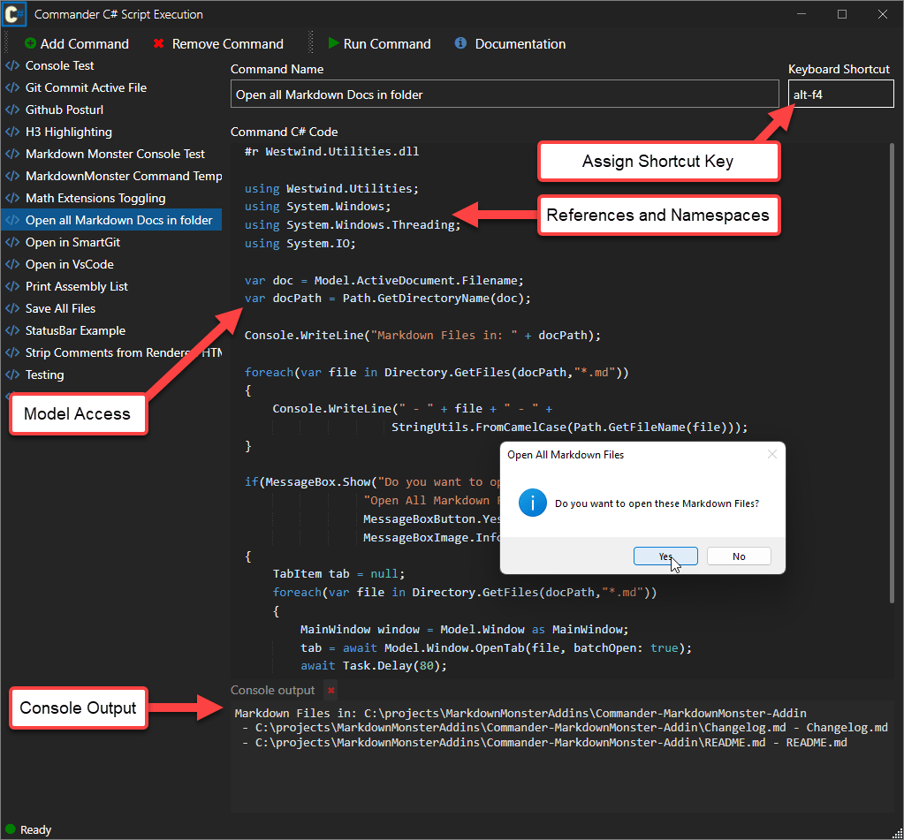

# Markdown Monster Commander Addin

#### A C# scripting addin for Markdown Monster

> #### Pre-release 
> This addin is currently in alpha state and only available in source code format.

This add-in lets you extend Markdown Monster via custom C# scripts or external executable that can be tied to a hotkey or can be executed via the Commander addin's user interface. Commander scripts can be thought of as mini add-ins that can be created without requiring a full addin.

### Simple Examples
The following script runs some arbitrary code and displays a message box:

You can also launch external code easily. For example to launch my Git client (SmartGit) in the repo for the current document I can do:

### C# Script Execution
Scripts are executed as C# code, using a dynamically generated method inside of an in-memory assembly. You can pretty much execute any .NET code as long as you can reference the required assemblies you need for your code to execute.

### Assembly Reference and Namespace Dependencies
In order to execute code, the generated assembly has to explicitly reference any reference assembly references. 

The script parser used in this add-in allows for custom syntax at the top of the script to specify assembly references and namespaces as follows.

* `#r <assemblyReference>`   
This loads an assembly reference into the script - you can reference any GAC assembly or any assembly that is available through Markdown Monster's root folder. Note: **no externally loaded assemblies are allowed** which means anything you want to use you have to explicitly copy into **the Markdown Monster install folder**.

* `using <namespace>`  
This allows adding namespace references to your scripts the same way you'd use a using statement in a typical .NET class. 

Both of these commands have to be specified at the top of the script text.

Other than that you can 

