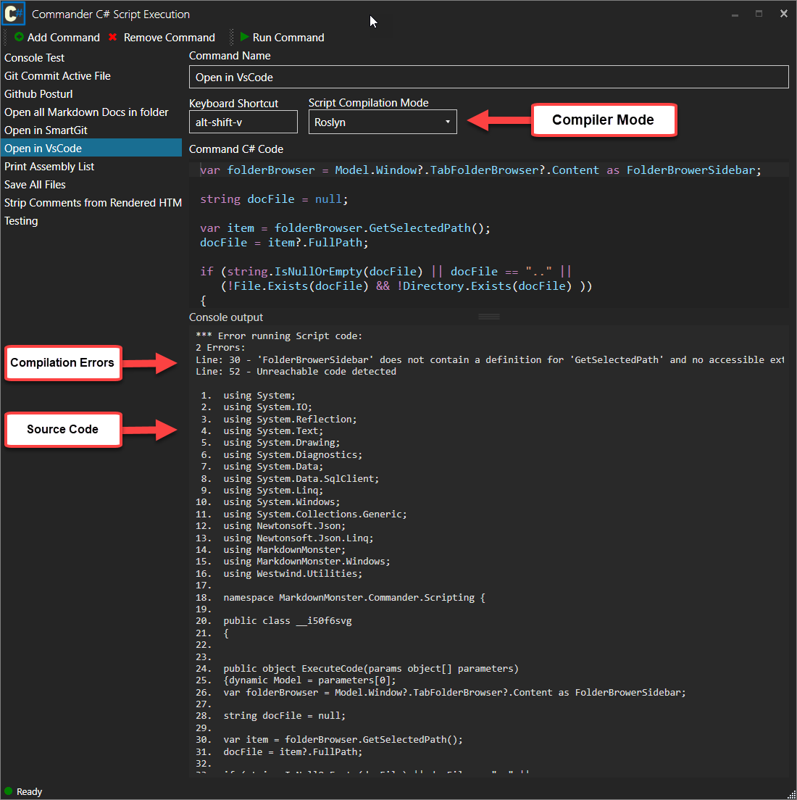

# Markdown Monster Commander Addin

#### A C# scripting addin for Markdown Monster


> #### Pre-release 
> This addin is currently in alpha state and only available in source code format.

This add-in lets you extend Markdown Monster via custom C# scripts or by easily calling external executables that can be tied to a hotkey or can be executed via the Commander addin's user interface. Commander scripts can be thought of as mini add-ins that can be created without requiring the creation of a full blown addin using small snippets of C# Script code.

### Features
Commander has the following  useful features:

* C# Scripting - full C# language access
* Reference and Namespace imports
* Access to Markdown Monster's Model
    * Access to Document
    * Access to Editor
    * Access to Window and WPF UI
* Console Output for Debugging

### What can you do with it?
Heck the sky's the limit, but here are some simple things I've done with it just in the last couple of weeks:

* Open my Git Client in the right folder context
* Open all related documents
* Launch an image optimizer to optimize all images
* Creating pre-filled documents into the editor  
(which you can also do with the [Snippets addin]())


### Simple Examples
The following script in the figure retrieves the active document's filename, then shows a directory listing of Markdown Files in the same folder in the Console, and then asks if you want to open the listed files in the editor:


You can also launch external code easily. For example to launch my Git client (SmartGit) in the repo for the current document I can do:



### C# Script Execution
Scripts are executed as C# code, using a dynamically generated method inside of an in-memory assembly. You can pretty much execute any .NET code as long as you can reference the required assemblies you need for your code to execute.

### Assembly Reference and Namespace Dependencies
In order to execute code, the generated assembly has to explicitly load referenced assemblies. The script parser used in this add-in allows for custom syntax at the top of the script to specify assembly references and namespaces as follows:

```cs
#r Westwind.Utilities.dll
using Westwind.Utilities

// Your method code here
System.Windows.MessageBox.Show("Got it!");
```

### `#r <assemblyReference>`
The `#r` directive is used to reference an assembly by filename. Note you don't have to specify a path as the addin only looks for assemblies in specific paths - ideally the Markdown Monster install path.

This loads an assembly reference into the script - you can reference any GAC assembly or any assembly that is available through Markdown Monster's root or `Addins` folder. 

> #### No external Assemblies allowed
> For security reasons, we don't allow execution of pathed assemblies. All assemblies should be referenced just by their .dll file name (ie. `mydll.dll`).
>
>You can only load assemblies located in the GAC, the Markdown Monster Root Folder or the `Addins` folder below (any sub-folder). These folders are restricted on a normal install and require admin rights to add files, so random files cannot be copied there easily and maliciously executed.
>
> If you need external assemblies in your Scripts or Snippets we recommend you create a folder below the Addins folder like `SupportAssemblies` and put your referenced assemblies there.. 

### `using <namespace>`  
This allows adding namespace references to your scripts the same way you'd use a using statement in a typical .NET class. Make sure any Assemblies you need are loaded. The Command Addin pre-references many common references and namespaces.

Both of these commands have to be specified at the top of the script text.


